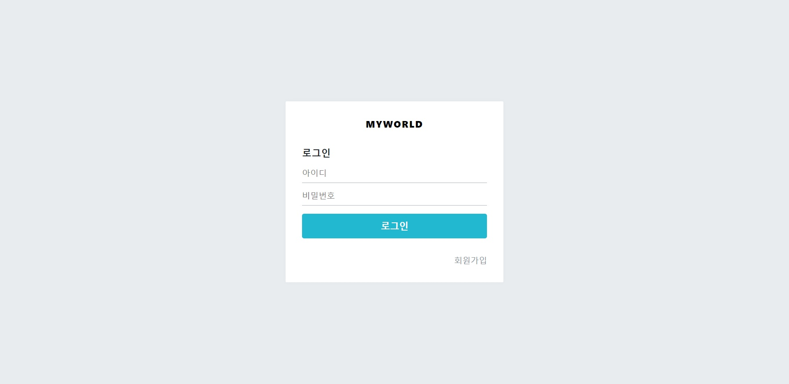
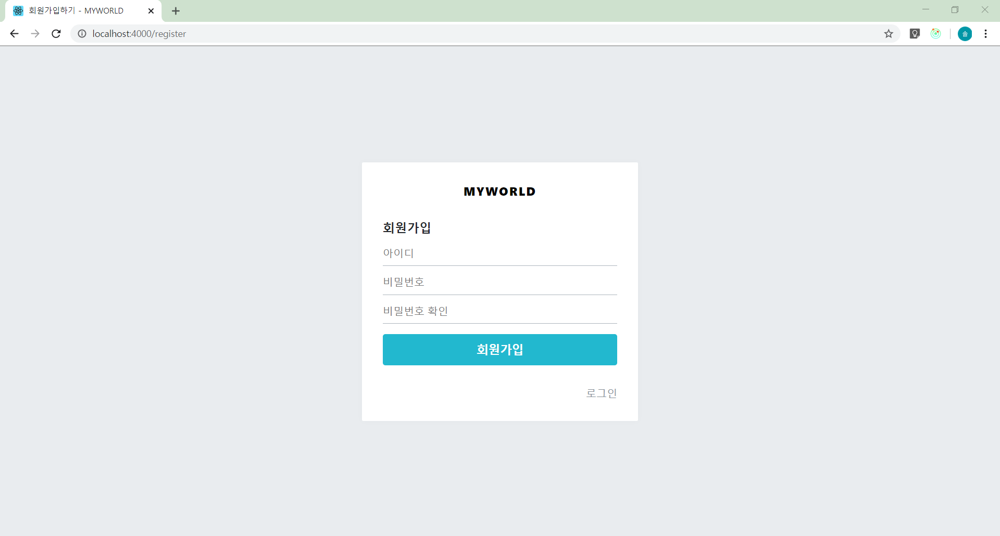
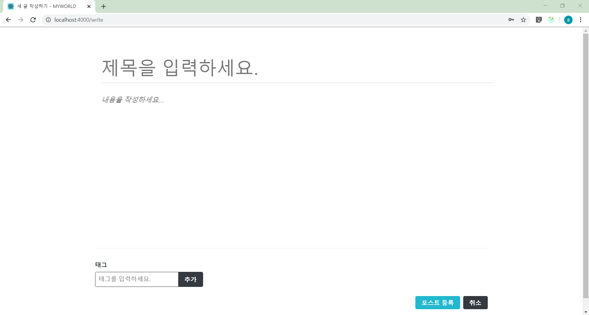
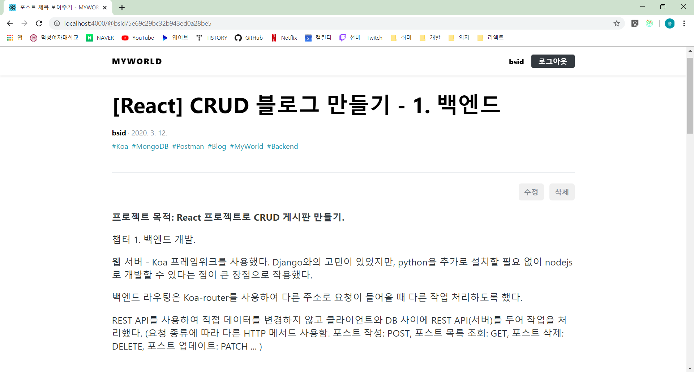
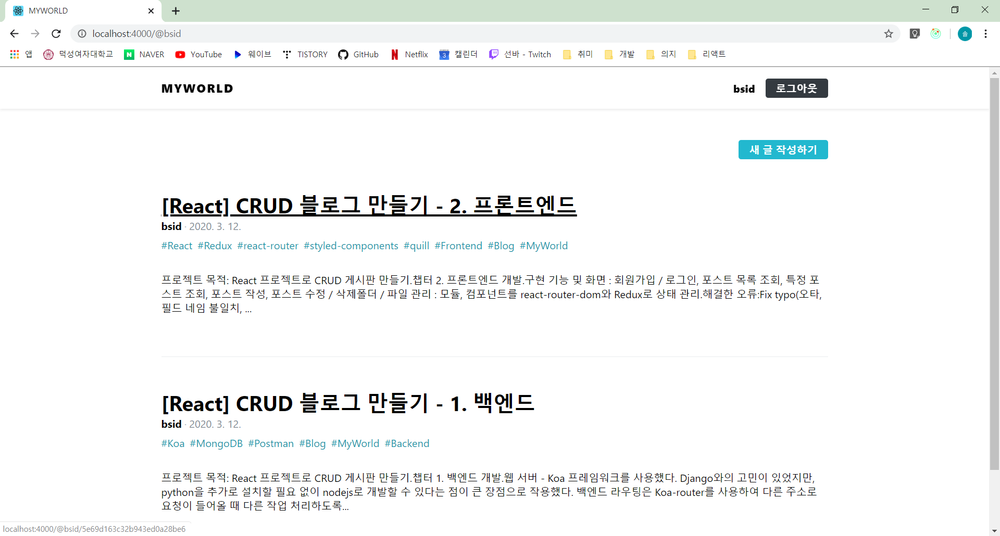

# MyWorld

CRUD Blog with
Front-End: React, Redux
Back-End: Koa, MongoDB

## Pages

> Login
> 

> Register
> 

> Write
> 

> Post
> 

> Postlist
> 

## How to run

    cd my-world-backend
    yarn start:dev
